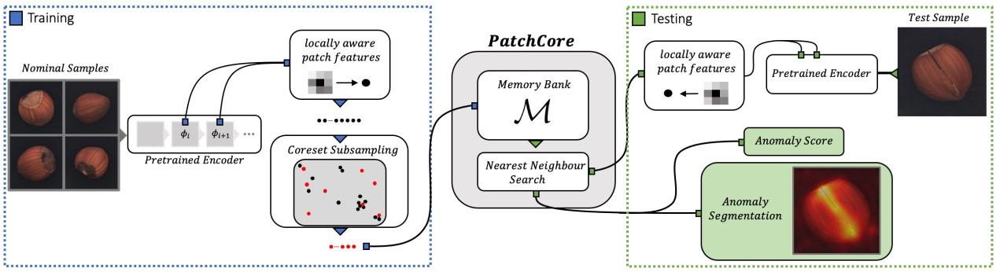

# PatchCore anomaly detection
Unofficial implementation of PatchCore(new SOTA) anomaly detection model

Original Paper : 
Towards Total Recall in Industrial Anomaly Detection (Jun 2021)  
Karsten Roth, Latha Pemula, Joaquin Zepeda, Bernhard Schölkopf, Thomas Brox, Peter Gehler  

https://arxiv.org/abs/2106.08265  
https://paperswithcode.com/sota/anomaly-detection-on-mvtec-ad

notice(21/06/18) :  
This code is not yet verified. Any feedback is appreciated.  
updates(21/06/21) :  
- I used sklearn's SparseRandomProjection(ep=0.9) for random projection. I'm not confident with this.
- I think exact value of "b nearest patch-features" is not presented in the paper. I just set 9. (args.n_neighbors)  
- In terms of NN search, author used "faiss". but not implemented in this code yet. 
- sample embeddings/carpet/embedding.pickle => coreset_sampling_ratio=0.001  

### Usage 
~~~
# install python 3.6, torch==1.8.1, torchvision==0.9.1
pip install -r requirements.txt

python train.py --phase train or test --dataset_path .../mvtec_anomaly_detection --category carpet --project_root_path path/to/save/results --coreset_sampling_ratio 0.01 --n_neighbors 9'

# for fast try just specify your dataset_path and run
python train.py --phase test --dataset_path .../mvtec_anomaly_detection --project_root_path ./
~~~

### MVTecAD AUROC score (PatchCore-1%, mean of n trials)
| Category | Paper (image-level) | This code (image-level) | Paper (pixel-level) | This code (pixel-level) |
| :-----: | :-: | :-: | :-: | :-: |
| carpet | 0.980 | 0.997(1) | 0.989 | 0.990(1) |
| grid | 0.986 | 0.941(1) | 0.986 | 0.983(1) |
| leather | 1.000 | 1.000(1) | 0.993 | 0.991(1) |
| tile | 0.994 | 0.982(1) | 0.961 | 0.932(1) |
| wood | 0.992 | 0.999(1) | 0.951 | 0.976(1) |
| bottle | 1.000 | 0.986(1) | 0.985 | 0.941(1) |
| cable | 0.993 | 0.970(1) | 0.982 | 0.955(1) |
| capsule | 0.980 | 0.949(1) | 0.988 | 0.987(1) |
| hazelnut | 1.000 | 0.997(1) | 0.986 | 0.982(1) |
| metal nut | 0.997 | 0.997(1) | 0.984 | 0.962(1) |
| pill | 0.970 | 0.918(1) | 0.971 | 0.941(1) |
| screw | 0.964 | 0.967(1) | 0.992 | 0.987(1) |
| toothbrush | 1.000 | 0.997(1) | 0.985 | 0.984(1) |
| transistor | 0.999 | 0.960(1) | 0.949 | 0.894(1) |
| zipper | 0.992 | 0.968(1) | 0.988 | 0.987(1) |
| mean | 0.990 | 0.975 | 0.980 | 0.966 |

### Code Reference
kcenter algorithm :  
https://github.com/google/active-learning  
embedding concat function :  
https://github.com/xiahaifeng1995/PaDiM-Anomaly-Detection-Localization-master
